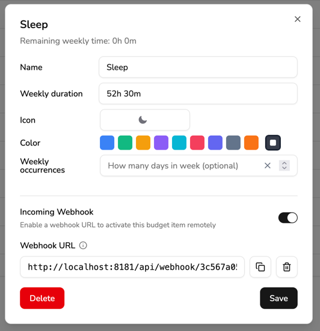

import {Steps} from "@astrojs/starlight/components";

This guide provides examples of automating tasks on Android devices using [Automate](https://llamalab.com/automate/).

### Enable sleep budget item when the phone is charging for 5 minutes

This example is useful if you connect your phone to a charger before you go to sleep.

It uses [Incoming Webhooks](/docs/integrations/incoming-webhooks) in Klokku to change the budget item.

<Steps>
    1. Go to the Klokku budget plan page and enable the webhook for the "Sleep" budget item.\
       More details in [Integrations](/docs/integrations/incoming-webhooks#enable-budget-item-incoming-webhook).
    2. Copy the webhook URL.\
       
    3. Open Automate and import the [workflow](/docs/public/automate-flows/klokku-sleep-on-charging.flo).
    4. Open the workflow in edit mode.
    5. Configure the workflow by editing these variables:
        - `webhookUrl`: Paste the URL from step 2.
        - `sleepTimeAfter`: The time after which charging the mobile will trigger the flow (set to 9 PM by default: `21 * 60 * 60`).
        - `sleepTimeBefore`: The time before which charging the mobile will trigger the flow (set to 5 AM by default: `5 * 60 * 60`).
    6. Exit edit mode.
    7. Start the workflow.
</Steps>
