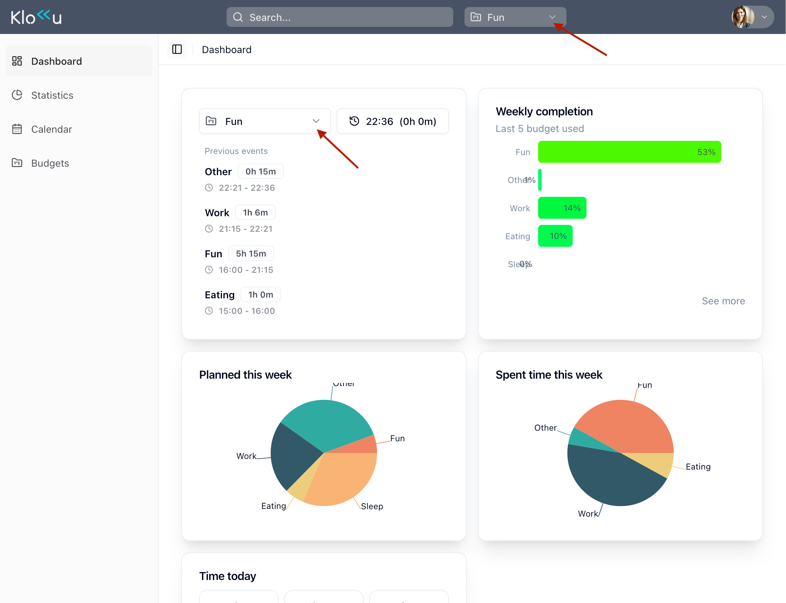

## Create a user profile
The first thing you need to do is create a user profile.\
Klokku requires some basic information about you to function properly.

## Define budgets

A **budget** defines how much time you want to allocate to a specific activity, group of activities, or project.
For each budget, you need to specify how much time you plan to dedicate to it every week.
Common examples of budgets include:
- Sleep
- Work
- Study
- Personal
- Family
- Sport
- Other (more on that later)

Your total of 168 hours per week should be divided among all your budgets.

There is one special budget — the **other** budget. You can rename it if you wish.
This budget is used to track any time not covered by your other budgets. It’s essential because, for most people, it’s unrealistic to plan for every hour of the week.

When you sign in to Klokku for the first time, you’ll see a setup wizard like this:

This wizard will guide you through the process of defining your budgets.

---

:::tip[Tips for defining budgets]
- Distribute all 168 hours of your week across budgets
- Avoid creating too many or overly specific budgets — 10–12 is usually enough to start
- Assign at least 10 hours per week to the **other** budget — you may be surprised how much time goes into unplanned activities
:::

## Choose the current budget

Now it’s time to choose your current budget. Whenever you start a new activity, select the budget that best matches what you’re doing.
This provides Klokku with the data it needs to generate insights, helping you understand where your time goes and making it easier to plan ahead.

There are two ways to choose your current budget:
- The always-visible dropdown on the top bar
- Current budget card on the dashboard

:::tip[Automate current budget]
Keeping track of the current budget manually might be hard. Klokku offers a way to automate this process. \
Check available [integrations]() documentation to learn more.
:::
