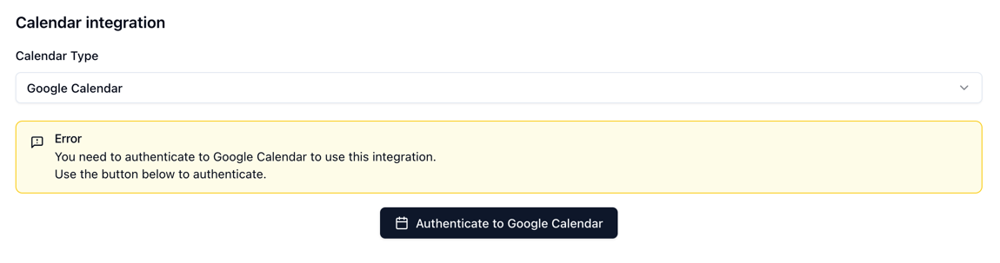

Klokku supports storing events in Google Calendar instead of the internal database.
You can switch to Google Calendar integration in the **Calendar integration** section of the **Profile** page. 

When Google Calendar is chosen as a calendar type, the events are stored in the Google Calendar only. They are not stored in the internal database.

To access authenticate hosted instance of Klokku to Google Calendar, you need to configure Google Calendar API Client first.
 

## 1. Google Cloud Console Configuration

This step is required to retrieve `KLOKKU_GOOGLE_CLIENT_ID` and `KLOKKU_GOOGLE_CLIENT_SECRET` values, which are used to authenticate Klokku to Google Calendar.

1. Log in to the [Google Cloud Console](https://console.cloud.google.com/).
2. Click **Select a project**.
3. In the pop-up window, click **New project**.
4. Insert your Project Name and Location.  
5. Click the hamburger menu on the left-hand side and select **APIs & Services**.
6. From the navigation menu, select **Library**.
7. In the search field, type in *Google Calendar API*.
8. Select the *Google Calendar API* tile.
9.  Click **Enable**.
10. From the navigation menu, select **Credentials**.
11. Click **+ Create credentials** button from the top ribbon and select **OAuth client ID**. 

    >**Note:** To create an OAuth client ID, you must have your consent screen configured. To create the Google Auth Platform: 
    >1.  Click **Configure consent screen**.
    >2. Insert the following information:\
        - App name (you can insert any name).\
        - User support email.
    >3. Click **Next**.
    >4. Select **External** and click **Next**.
    >5. Insert contact information.
    >6. Select the *I agree to the Google API Services: User Data Policy* checkbox and click **Continue**.
    >7. Click **Create**.
12. From the drop-down menu, select the *Web application* type.
13. Copy the `http://<KLOKKU_HOST>:<KLOKKU_PORT>/api/integrations/google/auth/callback` address to the *Authorized redirect URIs* field and define the following variables:
    - `KLOKKU_HOST`: the host of your Klokku instance
    - `KLOKKU_PORT`: the port of your Klokku instance 
14. Click **Create**.

    The pop-up window with the OAuth client credentials is displayed. Record your Client ID and Client secret values, or click the **Download JSON** button, to save the credentials in a JSON file. Use these credentials during the Klokku installation. 


## 2. Google Calendar API Client in Klokku

To use Google Calendar integration in Klokku, you need to configure the following environment variables:

- `KLOKKU_GOOGLE_CLIENT_ID`: your Google Cloud Client ID
- `KLOKKU_GOOGLE_CLIENT_SECRET`: your Google Cloud client secret.

If you run Klokku in a Docker container, you can pass these variables using the `-e` flag like this:

```shell
docker run -d --name klokku \
   -p 8181:8181 \
   -v storage:/app/storage \
   -e KLOKKU_HOST="http://localhost:8181" \
   -e KLOKKU_GOOGLE_CLIENT_ID="<GOOGLE_CLIENT_ID>" \
   -e KLOKKU_GOOGLE_CLIENT_SECRET="<GOOGLE_CLIENT_SECRET>" \
   ghcr.io/klokku/klokku:latest
```


## 3. Change events storage to Google Calendar


1. Go to the **Profile** page.
2. Scroll down to the **Calendar integration** section.
3. Change **Calendar Type** to **Google Calendar**.
4. Click **Authenticate to Google Calendar**
5. Accept the permission request.
6. Choose the Google Calendar to store events from the drop-down menu.


