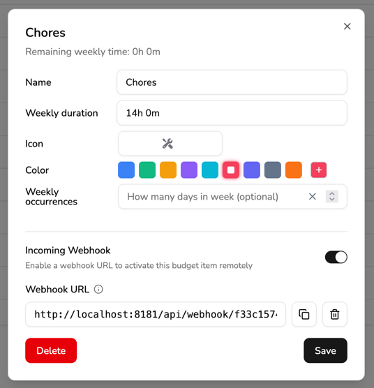

import {TabItem, Tabs} from "@astrojs/starlight/components";
import KlokkuUrlDisplay from "../../../lib/components/klokku-url-display.astro";

Klokku supports incoming webhooks to change a current budget item.\
This feature simplifies automating change of a budget item, based on external events or data.
For example, you can set up a webhook to automatically set your budget item to `work` when turning on your work computer or to `commute` when leaving the office.

Klokku can generate a special URL for each budget item that looks like this:

<KlokkuUrlDisplay postfix="/api/webhooks/SECRET_TOKEN" as="code" client:load />

When this URL is called with a `POST` request, Klokku will change the current budget item to the item related to the webhook URL.

## Enable budget item Incoming Webhook

To enable a budget item webhook:

1. Go to the budget plans page -<KlokkuUrlDisplay postfix="/budget-plans" as="a" client:load />
2. Click on the chosen budget item name.\
   This will open the budget item details page.
3. Toggle the "Incoming Webhook" switch.

The Webhook URL will be displayed in the budget item details page, under the "Webhook URL" section.

:::caution[Webhook URL change]
The webhook URL will change every time you toggle the "Incoming Webhook" switch.
:::

## How to call the Incoming Webhook

You can call the webhook URL with any HTTP client. These kinds of clients are available in many automation tools like Home Assistant, Zapier, IFTTT, n8n, Android Tasker, etc.

To test the webhook, you can use the `curl` command:

<Tabs>
    <TabItem label="Linux">
        <KlokkuUrlDisplay prefix="curl -X POST " postfix="/api/webhooks/SECRET_TOKEN" as="code-block" client:load />
    </TabItem>
    <TabItem label="macOS">
        <KlokkuUrlDisplay prefix="curl -X POST " postfix="/api/webhooks/SECRET_TOKEN" as="code-block" client:load />
    </TabItem>
    <TabItem label="Windows">
        This command works on Windows 10 version 1803 and later.
        <KlokkuUrlDisplay prefix="curl.exe -X POST " postfix="/api/webhooks/SECRET_TOKEN" as="code-block" client:load />
    </TabItem>
</Tabs>

